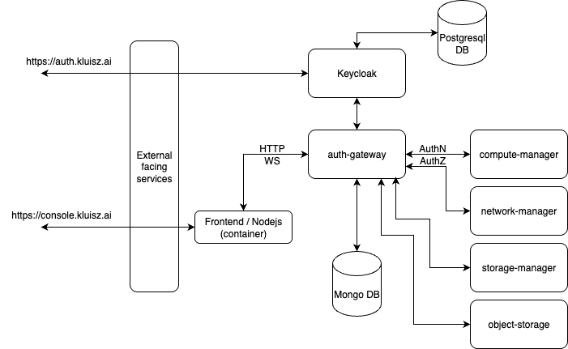

# Helm Charts Repo

while using these ihelm charts ensure you have a working kubernetes setup with
following dependencies taken care of
  - CNI - any k8s recommended plugin as the primary CNI (calico, kubeovn, etc)
  - Storage class - any storage provider for persistent volumes to be used
  - metallb is preferred but not necessary, allows working with VIPs

## Storage class - Dev Environment
while working with devlopment environments with single node, alternatively you
can use simpler storage class local-path-provisioner provided by rancher

```
kubectl apply -f https://raw.githubusercontent.com/rancher/local-path-provisioner/v0.0.31/deploy/local-path-storage.yaml
```

Additionally it can be marked as default to ensure that one doesn't require to
explicitly configure the storage class name everywhere to provide volumes
```
kubectl patch storageclass local-path \
  -p '{"metadata": {"annotations":{"storageclass.kubernetes.io/is-default-class":"true"}}}'

```

## Controller Deployment

Controller services rollout and positioning for API requests are as shown in the diagram below
